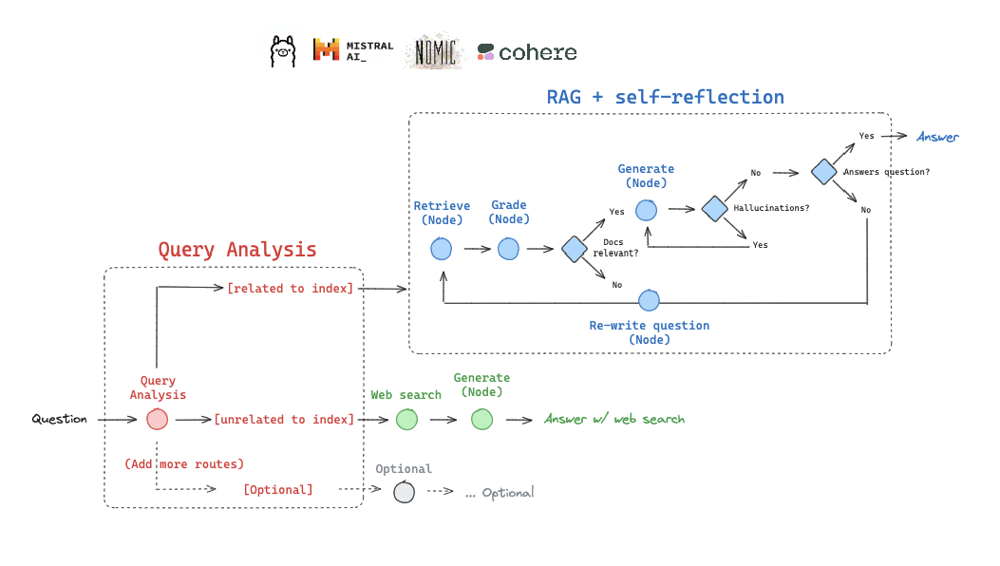

# Adaptive Rag


#### Adaptive RAG is a strategy for RAG that unites (1) query analysis with (2) active / self-corrective RAG.

In this implementation, we will route between:

- **Web search**: for questions related to recent events
- **Self-corrective RAG**: for questions related to our index

AI-Powered Question-Answering System with LangChain
This code implements a sophisticated question-answering system using LangChain and related libraries. Below is a breakdown of its components and functionality in markdown format:

### 1. Setup and Data Ingestion
URLs: The code starts by defining URLs related to LLMs, prompt engineering, and adversarial attacks.
Document Loading: It uses WebBaseLoader to fetch documents from these URLs into a list called docs_list.
Text Splitting: Documents are split into chunks of 500 characters using RecursiveCharacterTextSplitter, ensuring no overlap between chunks.
Vectorstore Creation: These chunks are stored in a Chroma vectorstore named "rag-chroma" using embeddings, enabling efficient document retrieval.
### 2. LLM Configuration
The code configures an LLM (ChatOllama) for various tasks including routing, generation, and grading.
### 3. Routing Component
A question router uses a prompt template to decide whether to use the vectorstore or perform a web search based on the user's question, returning either 'web_earch' or 'vectorstore'.
- **JsonOutputParser**: Converts the model's output into a JSON format. It helps extract structured data (in this case, a key called datasource).
```python
prompt = PromptTemplate(
    template="""You are an expert at routing a user question to a vectorstore or web search. \n
    Use the vectorstore for questions on LLM  agents, prompt engineering, and adversarial attacks. \n
    You do not need to be stringent with the keywords in the question related to these topics. \n
    Otherwise, use web-search. Give a binary choice 'web_search' or 'vectorstore' based on the question. \n
    Return the a JSON with a single key 'datasource' and no premable or explanation. \n
    Question to route: {question}""",
    input_variables=["question"],
)
```
- PromptTemplate: This defines the structure of the question and the model's instructions.

    The **template** instructs the LLM on how to route a question based on the content.
    The input_variables specifies that the question will be passed into the prompt template.
- Routing logic:

    - If the question is related to LLM agents, prompt engineering, or adversarial attacks, route it to the vectorstore.
    - For other questions, route it to web search.
```python
question = "llm agent memory"
docs = retriever.get_relevant_documents(question)
doc_txt = docs[1].page_content
```
- question: A sample question is provided ("llm agent memory").
- retriever.get_relevant_documents(question): This fetches documents relevant to the question from the retriever (which likely uses a vectorstore or database).
- doc_txt: Extracts the content of the second relevant document for further processing.

The model returns the result in a JSON format with the key 'datasource', which will indicate whether the answer should come from 'web_search' or 'vectorstore'.

4. Retrieval and Grading
This **Retrieval Grader** system that evaluates the relevance of a retrieved document based on a user’s question. It uses a language model (LLM) to determine whether the document contains relevant information for the given question and provides a binary "yes" or "no" score indicating the relevance.
**Retrieval**: Retrieves documents from the vectorstore relevant to the user’s question.
**Relevance Grader**: Assesses if retrieved documents are relevant, filtering out irrelevant ones.
1. #### Define the Prompt Template
```python
prompt = PromptTemplate(
    template="""You are a grader assessing relevance of a retrieved document to a user question. \n 
    Here is the retrieved document: \n\n {document} \n\n
    Here is the user question: {question} \n
    If the document contains keywords related to the user question, grade it as relevant. \n
    It does not need to be a stringent test. The goal is to filter out erroneous retrievals. \n
    Give a binary score 'yes' or 'no' score to indicate whether the document is relevant to the question. \n
    Provide the binary score as a JSON with a single key 'score' and no premable or explanation.""",
    input_variables=["question", "document"],
)
```
- **PromptTemplate**: Defines how the question and document should be passed into the model for evaluation.

    **Template**: The text in the template instructs the model to assess whether a document is relevant to a user’s question.
    - The model is asked to assess relevance based on whether the document contains keywords related to the question.
    - The goal is to filter out irrelevant documents, so a binary score ("yes" or "no") is used.
    - The model is asked to return the score as a JSON with a single key score, with no explanation or preamble.

- input_variables: Specifies that the input variables to the template will be question and document.
2. #### Prepare the Question and Documents:
```python
question = "agent memory"
docs = retriever.get_relevant_documents(question)
doc_txt = docs[1].page_content
```
- question: The question being asked by the user, in this case, "agent memory".
- retriever.get_relevant_documents(question): This retrieves the relevant documents from the retriever based on the user’s question.
- doc_txt: Extracts the content of the second retrieved document (docs[1]) for evaluation.
3. #### Invoke the Retrieval Grader:
```python
print(retrieval_grader.invoke({"question": question, "document": doc_txt}))
```
- retrieval_grader.invoke(): This executes the retrieval grading process.

- The question and retrieved document (doc_txt) are passed into the grader.
- The grader uses the language model to assess whether the document is relevant to the question.
- The model returns a binary score ("yes" or "no") in JSON format.

5. Answer Generation (RAG Chain)
Uses a prompt pulled from HuggingFace Hub with ChatOllama to generate answers based on the context of retrieved documents.
6. Quality Control Components
1. **Hallucination Grader**: Checks if generated answers are grounded in provided documents.
The Hallucination Grader code is designed to assess whether a given generation (answer) from a language model is grounded in or supported by a provided set of facts (documents). This helps detect and filter out hallucinated answers, where the model provides incorrect or fabricated information not supported by the input facts.
```python
prompt = PromptTemplate(
    template="""You are a grader assessing whether an answer is grounded in / supported by a set of facts. \n 
    Here are the facts:
    \n ------- \n
    {documents} 
    \n ------- \n
    Here is the answer: {generation}
    Give a binary score 'yes' or 'no' score to indicate whether the answer is grounded in / supported by a set of facts. \n
    Provide the binary score as a JSON with a single key 'score' and no preamble or explanation.""",
    input_variables=["generation", "documents"],
)
```
- PromptTemplate: This defines the structure and instructions for the model, guiding it on how to evaluate the answer's accuracy.

- template: The text defines the prompt structure.
    **{documents}**: Placeholder for the set of facts (documents) provided to the model.
    **{generation}**: Placeholder for the generated answer.
    - The prompt instructs the model to assess if the answer is grounded in or supported by the provided facts.
    - The model must then give a binary score ("yes" or "no") to indicate whether the answer is correct and supported by the documents.
- input_variables: Specifies that the input variables to the template will be the answer (generation) and the documents (documents).
2. **Answer Grader**: Evaluates whether the answer is useful for resolving the user’s question, ensuring relevance and usefulness.

7. **Query Transformation**
A question re-writer transforms the original query to optimize it for better retrieval results, enhancing the effectiveness of subsequent steps.
8. **Web Search Integration**
The system uses TavilySearchResults to perform web searches when the question is routed there, fetching relevant online content.
9. **Workflow Graph**
Components are connected in a graph structure using LangGraph, defining conditional flows based on outcomes from grading and routing steps.
For example:
After routing, it proceeds to either web search or document retrieval.
If documents are deemed irrelevant, the query is transformed for re-retrieval.
Generated answers undergo checks for hallucinations and usefulness, determining if further action (like re-generating) is needed.
1. ### GraphState: 
This class defines the state of the graph in a typed format using TypedDict.

    - TypedDict is used here to specify that the dictionary will have a fixed set of keys with specific types for each key.
    - The GraphState dictionary will have:
        - question: A string representing the question being asked.
        - generation: A string representing the generated answer from a language model (LLM).
        - documents: A list of strings, where each string represents a document or a relevant piece of information related to the question and answer generation.
**TypedDict** enforces specific types for its keys
2. ### Nodes
These are functions that perform specific tasks in the workflow.

1. **retrieve(state)**:

- Retrieves relevant documents based on the user's question using a retriever.
- Returns the retrieved documents along with the original question.
2. **generate(state)**:

- Generates an answer to the question using Retrieval-Augmented Generation (RAG) by leveraging the retrieved documents.
- Returns the generated answer along with the documents and question.
3. **grade_documents(state)**:

- Filters the retrieved documents to retain only those relevant to the question based on a scoring mechanism.
- If a document is not deemed relevant, it's excluded from further processing.
4. **transform_query(state)**:

- Rewrites or refines the original question to improve its clarity or effectiveness for subsequent steps (e.g., web search).
- Returns the refined query along with any existing documents.
5 **web_search(state)**:

-Performs a web search using the transformed query.
-Aggregates the results into a single document and returns it along with the refined question.

### Edges
These functions determine the flow of data through the graph based on certain conditions or evaluations.

1. **route_question(state)**:

- Routes the question to either a web search or an internal RAG system (vectorstore) based on the determined source of information.
- Uses a router to decide whether to prioritize online sources or existing knowledge bases.
2. **decide_to_generate(state)**:

- Evaluates whether there are enough relevant documents after grading.
- If no relevant documents remain, it decides to transform the query again; otherwise, it proceeds to generate an answer.
3. **grade_generation_v_documents_and_question(state)**:

- Assesses if the generated answer is grounded in the provided documents and effectively addresses the question.
- Evaluates for hallucinations (unsubstantiated claims) and whether the answer sufficiently answers the query.
- Returns a decision on whether the generation is useful, not useful, or unsupported by the documents.
4. **Stateful graph**
Stateful graph is used process a user query, where different nodes represent specific steps in the process, such as web search, retrieval, grading documents, generation of answers, and transforming queries. The flow between the nodes is determined by conditional edges, which depend on the state of the system at each step.
**First Conditional Edge**: route_question
```python
workflow.add_conditional_edges(
    START,
    route_question,
    {
        "web_search": "web_search",
        "vectorstore": "retrieve",
    },
)
```
- route_question: The decision-making function that routes the question to either web_search or retrieve based on the contents of the question.

    - If the result of route_question is "web_search", the flow moves to the web_search node.
    - If the result is "vectorstore", the flow moves to the retrieve node.
**other conditional edges**:
- The transformation step feeds back into retrieval, allowing iterative refinement.
- After generating an answer, grade_termination checks if the answer is useful. If not, it loops back for further processing; if useful, the process ends.
10. Execution
The application is compiled from the workflow graph and run with a sample question: "What is the AlphaCodium paper about?"
Results are streamed and printed, showing intermediate steps and the final answer.
Key Features:
Modular Design: Components like routers, graders, generators, and transformers are modular, enhancing maintainability.
Quality Assurance: Multiple grading steps ensure answers are relevant, grounded, and useful.
Flexibility: Routes questions to either internal knowledge (vectorstore) or external sources (web search), ensuring comprehensive coverage.
Potential Considerations:
Dependencies: Relies on external tools like TavilySearch and specific models, requiring proper setup.
This system exemplifies a comprehensive AI-driven QA solution with built-in quality checks and adaptable source routing.


