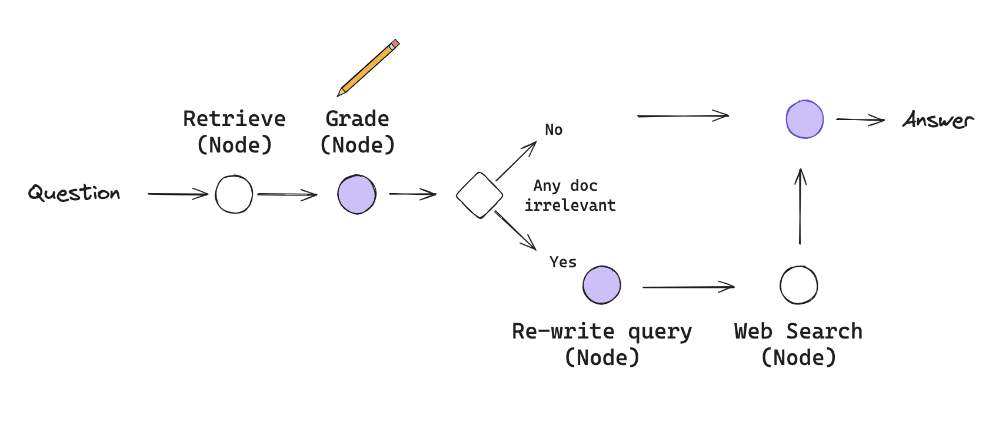

# Corrective RAG (CRAG)


#### Corrective-RAG (CRAG) is a strategy for RAG that incorporates self-reflection / self-grading on retrieved documents.

#### In this example, a few steps are taken:

- If at least one document exceeds the threshold for relevance, then it proceeds to generation
- Before generation, it performs knowledge refinement
- This partitions the document into "knowledge strips"
- It grades each strip, and filters our irrelevant ones
- If all documents fall below the relevance threshold or if the grader is unsure, then the framework seeks an additional datasource
- It will use web search to supplement retrieval

We will implement some of these ideas from scratch using LangGraph:

- If any documents are irrelevant, let's opt to supplement retrieval with web search.
- We'll use Tavily Search for web search.
- We use query re-writing to optimize the query for web search.

This system effectively combines traditional RAG with corrective measures to enhance answer accuracy by dynamically adjusting based on retrieval relevance. This code represents a complex, multi-step process that uses a variety of tools and techniques, including LangChain, Ollama models, and a graph-based workflow for processing and generating relevant content. I'll break it down into the main sections to explain what each part does:

## 1. Document Loading and Preprocessing

- **WebBaseLoader**: The WebBaseLoader is used to scrape web content from the provided URLs and load it into the document collection.
    - It loads content from three URLs, which are blog posts related to topics like agents, prompt engineering, and LLMs.
```python
    loader = WebBaseLoader(urls)
    documents = loader.load()
```

- **Text Splitting**: The RecursiveCharacterTextSplitter is used to split the loaded documents into smaller chunks to handle large content efficiently. The chunk size is set to 250 characters, with no overlap between chunks (chunk_overlap=0).
    - This helps break up large documents into manageable parts for further processing.
```pyhton
    text_splitter = RecursiveCharacterTextSplitter(chunk_size=250, chunk_overlap=0)
    splits = text_splitter.split_documents(documents)
```    

- **Embeddings**: OllamaEmbeddings is used to generate embeddings from the content of the documents. The embeddings represent each document chunk as numerical vectors, which will be stored in the vector database.
    - The model='mxbai-embed-large' specifies the embedding model to use.

- **Chroma VectorStore**: Chroma.from_documents creates a vector database from the document chunks and embeddings. It uses the OllamaEmbeddings model to generate embeddings and store the resulting vectors in the database (rag-chroma collection).
    - This will allow efficient similarity search when querying documents later.
```python
collection_name = "rag-chroma"
vectorstore = Chroma.from_documents(splits, embedding=ollama_embed, collection_name=collection_name)
retriever = vectorstore.as_retriever()
```

- **Retriever**: vectorstore.as_retriever() creates a retriever that can be used to query the database for relevant documents based on a question.

## 2. Grading the Relevance of Retrieved Documents

- **GradeDocuments Class**: This class defines the data model for grading documents as relevant or not based on their content. It returns a binary score (yes or no), indicating whether a document is relevant to the user's question.

**ChatOllama Model**: The model llama3.1 is used to assess the relevance of documents. The **ChatOllama model is wrapped in a function** that produces **structured output (GradeDocuments)**.
```python
class GradeDocuments(BaseModel):
    scores: list[str] = Field(..., description="Score of each document (yes/no)")

grader_chain = LlamaCpp(
    system_message=grade_prompt.get_template(),
    temperature=0,
    output_parser=OutputParserPydantic(GradeDocuments)
)
```
- **Grading Prompt**: The prompt is created to instruct the model to grade the relevance of a document. The system prompt tells the model that it should return a yes or no score based on whether the document contains keywords or semantic meaning related to the question.
    - grade_prompt defines the conversation with the system and the question context.

- **Retrieval Grader**: The retrieval_grader processes the documents and their relevance to the question by invoking the grading process. If the document is relevant, it will be kept; otherwise, it will be excluded from further processing.

## 3. Generating Answers Using RAG

- **RAG Chain**: The RAG (retrieval-augmented generation) chain combines a prompt, an LLM (Language Model), and an output parser (StrOutputParser) to generate an answer.
    - The prompt for generating answers is pulled from a model repository (hub.pull("rlm/rag-prompt")).
    - The output of this chain is parsed using StrOutputParser to convert the model's output into a usable string format.
```python
prompts = LangchainCommunityPromptTemplate()
prompt = prompts.get_prompt("rag/prompt.json")
document_formatting = DocumentFormatting(...)

def rag_chain():
    return LlamaCpp(
        system_message=prompt.get_template(),
        temperature=0.1,
        output_parser=output_parsers.JsonOutputParser()
    )
```
## 4. Rewriting Questions for Web Search Optimization

- **Question Rewriting**: The system is tasked with rephrasing the user’s question in a way that is better optimized for web searches. The ChatPromptTemplate is used to format the input and instruct the model to improve the question.
    - question_rewriter.invoke({"question": question}) rewrites the question for better semantic intent.
```python
transform_prompt = ChatPromptTemplate.from_messages([
    ("system", "Rewrite this question for better search results..."),
    ("user", "{question}")
])
```

## 5. Web Search

- **TavilySearchResults**: The TavilySearchResults tool is used to perform a web search based on the improved question. It retrieves relevant search results and appends them to the list of documents.
    - The function web_search appends search results to the documents collection, which will later be used for answer generation.
```python
def web_search(query: str):
    results = TavilySearchResults(...).results(query)
    return results
```
## 6. Graph-Based Workflow

- **GraphState**: This defines the state of the graph. It tracks the current status of the question, the documents, the generation (LLM output), and whether web search results should be included.
    - GraphState is a dictionary-like structure that stores the state for each step.

- **Graph Functions**: Each of the following functions represents a step in the graph:
    - **Retrieve**: Retrieves documents relevant to the question using the retriever.
    - **Generate**: Uses the rag_chain to generate an answer based on the retrieved documents.
    - **Grade Documents**: Filters documents based on relevance to the question, using the retrieval_grader.
    - **Transform Query**: Rewrites the question to better suit web searches.
    - **Web Search**: Performs a web search to find additional information based on the rewritten question.

- **Decide to Generate**: This function assesses whether the documents retrieved are relevant. If all documents are deemed irrelevant, it triggers the transformation of the query for a better search.

- **Graph Workflow**: The workflow is created using StateGraph from the langgraph library. Nodes representing each function (e.g., retrieve, grade documents, generate, etc.) are added to the graph, and edges are defined to control the flow of execution based on decisions made by the system.
```python
class GraphState(TypedDict):
    question: str
    generation: Any | None = None
    web_search: Any | None = None
    documents: list[Document] | None = None

def retrieve(...):
    # Retrieve and grade documents
    ...

def generate(...):
    # Generate answer from context
    ...

# Additional functions for query transformation and web search integration
```
    - **Conditional Edges**: The graph has conditional edges based on the relevance of documents (decide_to_generate). If no relevant documents are found, the query is transformed; otherwise, the generation process starts.
```python    
chain = LangGraph(...).to_chain()
result = chain.invoke(...)
```

- **Execution**: The graph is compiled using workflow.compile(), and inputs (the question) are passed through the graph for processing.
    - The state of the graph is updated at each node, and the final generation result is printed.
## 7. Final Output    
```python 
stream = chain.stream(...)
for output in stream:
    print(f"Current state: {output}")

print(f"\nFinal generation result:\n{result}")
```
- **Streaming**: The app is run with app.stream(inputs), where each output represents the state at a specific node in the graph (e.g., documents retrieved, question transformed, etc.).
    - Finally, the generated answer is printed after the workflow completes.

## Summary

This code demonstrates a complex pipeline where documents are retrieved, graded for relevance, and used for answer generation in a question-answering system. The flow is managed using a graph structure, and the process includes steps like document retrieval, relevance grading, question re-writing, web search, and final answer generation using a retrieval-augmented generation (RAG) approach. The system ensures that the output is optimized by continuously improving the query and filtering relevant documents. The CRAG system exemplifies a robust approach to query handling by combining traditional RAG with dynamic corrective measures. 