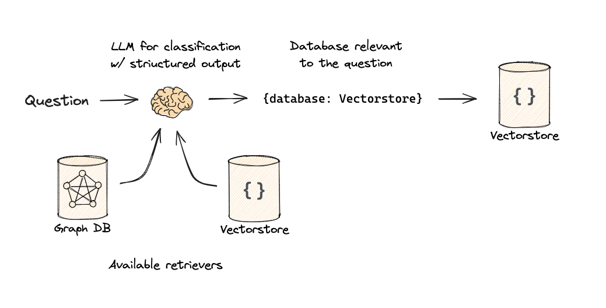

# Explanation of Code: Routing a User Query to a Data Source

This code demonstrates how to use a structured language model (LLM) with a custom **data model** to route user queries to the most relevant data source. The workflow involves defining a schema for expected outputs, creating a prompt for the model, and invoking the chain to process a user question.

---

## Key Components

### 1. **Data Model**
```python
from typing import Literal
from langchain_core.pydantic_v1 import BaseModel, Field

class RouteQuery(BaseModel):
    """Route a user query to the most relevant datasource."""

    datasource: Literal["python_docs", "js_docs", "golang_docs"] = Field(
        ...,
        description="Given a user question choose which datasource would be most relevant for answering their question",
    )
```

- Purpose: Defines the expected structure of the model's output using Pydantic.
    - datasource: A Literal field that restricts valid values to:
        - "python_docs" for Python-related queries.
        - "js_docs" for JavaScript-related queries.
        - "golang_docs" for Go-related queries.
- Validation: Ensures the output matches one of the predefined options, otherwise a validation error is raised.

### 2. Language Model Setup
```python
from langchain_ollama import ChatOllama

llm = ChatOllama(model="qwen2.5:32b-instruct-q4_K_M", temperature=0)
structured_llm = llm.with_structured_output(RouteQuery)
```
- ChatOllama: Represents the LLM configured with the "qwen2.5:32b-instruct-q4_K_M" model.
- temperature=0: Ensures deterministic outputs, critical for structured tasks like routing.
- with_structured_output: Configures the LLM to produce outputs conforming to the RouteQuery schema.

### 3. Prompt Definition
```python
from langchain_core.prompts import ChatPromptTemplate

system = """You are an expert at routing a user question to the appropriate data source.

Based on the programming language the question is referring to, choose one of the following datasources:
- 'python_docs' for Python-related questions
- 'js_docs' for JavaScript-related questions
- 'golang_docs' for Go-related questions.

Only respond with one of the above options."""

prompt = ChatPromptTemplate.from_messages(
    [
        ("system", system),
        ("human", "{question}"),
    ]
)
```

- System Message:
    - Provides instructions to the LLM about how to classify the input.
    - Specifies the valid responses (python_docs, js_docs, golang_docs).
- Human Message:
    - Dynamically injects the user's question into the prompt using {question}.

### 4. Router Definition
```python
router = prompt | structured_llm
```
- Chain: Combines the prompt with the structured LLM to create a pipeline.
- Execution: When invoked, the router processes the prompt and validates the output against the RouteQuery schema.

### 5. Invocation
```python
question = """Why doesn't the following code work:

from langchain_core.prompts import ChatPromptTemplate

prompt = ChatPromptTemplate.from_messages(["human", "speak in {language}"])
prompt.invoke("french")
"""

result = router.invoke({"question": question})
```
- Input Question: The user provides a programming-related question for routing.
- Processing Steps:
    1. Prompt Generation: The question is formatted into the defined prompt structure.
    2. Model Invocation: The prompt is passed to the LLM, which generates a response.
    3. Validation: The LLM's output is validated against the RouteQuery schema.
- Output (result): The datasource most relevant to the input question, e.g., "python_docs".

### Example Workflow
### Input:
```python
Why doesn't the following code work:

from langchain_core.prompts import ChatPromptTemplate

prompt = ChatPromptTemplate.from_messages(["human", "speak in {language}"])
prompt.invoke("french")
```
### Process:

1. Prompt Construction:
    - System message provides instructions.
    - The user’s question is formatted into the template.
2. LLM Output:
    - Model determines that the question relates to Python.
    - Output: "python_docs".
3. Validation:
    - The output matches the Literal constraint in the RouteQuery schema.

### Output:
```python
result = {"datasource": "python_docs"}
```