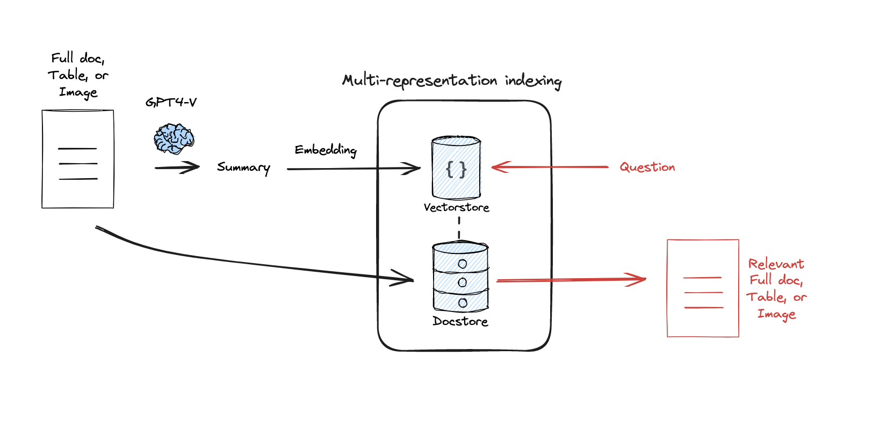

# Multi-representation Indexing
## Code Explanation: Document Summarization and Retrieval Pipeline

This code demonstrates a pipeline for loading, summarizing, embedding, and retrieving documents using LangChain's components. Below is an explanation of each section.

---

## 1. **Document Loading**
The `WebBaseLoader` loads web pages as documents:
```python
from langchain_community.document_loaders import WebBaseLoader

loader = WebBaseLoader("https://lilianweng.github.io/posts/2023-06-23-agent/")
docs = loader.load()

loader = WebBaseLoader("https://lilianweng.github.io/posts/2024-02-05-human-data-quality/")
docs.extend(loader.load())
```

- The first document is loaded from the given URL and stored in docs.
- Another document is appended to docs, effectively creating a list of documents.

2. Document Summarization

A summarization chain processes the documents to produce summaries:
```python
from langchain_core.output_parsers import StrOutputParser
from langchain_core.prompts import ChatPromptTemplate
from langchain_ollama import ChatOllama

chain = (
    {"doc": lambda x: x.page_content}
    | ChatPromptTemplate.from_template("Summarize the following document:\n\n{doc}")
    | ChatOllama(model="llama3.1", max_retries=0)
    | StrOutputParser()
)

summaries = chain.batch(docs, {"max_concurrency": 5})
```
- Chain Components:
    1. Document Extractor: Extracts page_content from each document.
    2. Prompt Template: Uses a simple prompt to instruct summarization.
    3. Model: Utilizes the ChatOllama model for generating summaries.
    4. Output Parser: Converts model output to string format.
- The batch method processes documents concurrently, limiting concurrency to 5.

3. Embedding and Storage

The summaries are embedded and stored for retrieval:
```python
from langchain.storage import InMemoryByteStore
from langchain_ollama import OllamaEmbeddings
from langchain_community.vectorstores import Chroma
from langchain.retrievers.multi_vector import MultiVectorRetriever
from langchain_core.documents import Document
import uuid

embeddings = OllamaEmbeddings(model='mxbai-embed-large')
vectorstore = Chroma(collection_name="summaries", embedding_function=embeddings)
store = InMemoryByteStore()
id_key = "doc_id"
```
- Embeddings: OllamaEmbeddings generates vector representations of the summaries.
- VectorStore: A Chroma vector database indexes the embedded summaries.
- ByteStore: An in-memory storage layer links original documents with summaries using unique IDs.

### Linking Documents and Summaries
```python
doc_ids = [str(uuid.uuid4()) for _ in docs]
summary_docs = [
    Document(page_content=s, metadata={id_key: doc_ids[i]})
    for i, s in enumerate(summaries)
]
retriever.vectorstore.add_documents(summary_docs)
retriever.docstore.mset(list(zip(doc_ids, docs)))
```
- Unique IDs are generated for each document.
- Summaries are stored in the vectorstore, while the original documents are linked in the ByteStore.

4. Querying the Pipeline

Queries retrieve relevant documents based on semantic similarity:
```python
query = "Memory in agents"
sub_docs = vectorstore.similarity_search(query, k=1)
retrieved_docs = retriever.get_relevant_documents(query, n_results=1)
```
- similarity_search retrieves the most similar documents directly from the vectorstore.
- get_relevant_documents retrieves original documents linked to the summaries.

5. Output Examples

- Top Similar Document from VectorStore:
```python
sub_docs[0]
```
- Relevant Document's First 500 Characters:
```python
    retrieved_docs[0].page_content[0:500]
```
## Key Features

1. Web Scraping: Documents are loaded directly from URLs.
2. Summarization: Documents are summarized using a language model (llama3.1).
3. Embedding: Summaries are embedded as vectors for efficient similarity search.
4. Retrieval: Original documents are linked and retrievable based on queries.

## Use Cases

    Summarizing and indexing large collections of documents.
    Semantic search and question answering over document datasets.