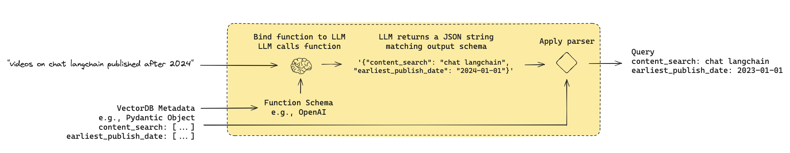

## Query structuring for metadata filters
#
This code demonstrates how to use `pydantic` models, LangChain prompts, and an LLM (Large Language Model) to structure and analyze a user query into a database search schema. It involves defining filters for searching tutorial videos, a system prompt for query generation, and leveraging an LLM for structured output.

---

#### **Code Breakdown**

1. **Imports**
```python
   import datetime
   from typing import Literal, Optional, Tuple
   from langchain_core.pydantic_v1 import BaseModel, Field
```
- datetime: Handles date-based fields for filtering videos by publish date.
- Optional: Allows fields to be nullable.
- BaseModel and Field (from pydantic): Define a structured schema for input validation.

2. Defining the TutorialSearch Class This pydantic model defines the filters for searching tutorial videos.
```python
class TutorialSearch(BaseModel):
    """Search over a database of tutorial videos about a software library."""
```
- Fields:
    - content_search: Query for searching within video transcripts.
    - title_search: A succinct query for searching video titles.
    - min_view_count & max_view_count: Filters for video views.
    - earliest_publish_date & latest_publish_date: Date range filters.
    - min_length_sec & max_length_sec: Video duration filters.

Example Field:
```python
content_search: str = Field(
    ...,
    description="Similarity search query applied to video transcripts."
)
```

- Method: pretty_print Prints the fields and their values that have been explicitly set (non-default values).
```python
        def pretty_print(self) -> None:
            for field in self.__fields__:
                if getattr(self, field) is not None and ...
```
3. Defining the System Prompt A prompt guides the LLM to convert user questions into structured database queries.
```python
    system = """You are an expert at converting user questions into database queries. ...
    """
```
4. Setting Up the Chat Prompt The ChatPromptTemplate processes user queries:
```python
    prompt = ChatPromptTemplate.from_messages(
        [("system", system), ("human", "{question}")]
    )
```
5. LLM Integration A ChatOllama model is initialized and linked with structured output using the TutorialSearch schema.
```python
    llm = ChatOllama(model="llama3.1")
    structured_llm = llm.with_structured_output(TutorialSearch)
```
6. Creating the Query Analyzer The prompt and LLM are combined into a pipeline (query_analyzer):
```python
    query_analyzer = prompt | structured_llm
```
7. Using the Query Analyzer The analyzer processes the query and prints the resulting structured search:
```python
    query_analyzer.invoke({"question": "rag from scratch"}).pretty_print()
```
### Execution Flow

1. Input: The user provides a question: "rag from scratch".
2. Processing:
    - The system prompt guides the LLM to convert the question into a structured query.
    - The TutorialSearch schema validates and organizes the query into fields.
3. Output:
    - The structured query is printed with the pretty_print method.

### Key Features

Dynamic Query Structuring: Converts natural language queries into structured database filters.
- Schema Validation: Ensures input consistency using pydantic.
- LLM-Powered Analysis: Leverages an LLM to generate and format queries.
- This pipeline demonstrates how LangChain can simplify user query handling for databases of tutorial videos.