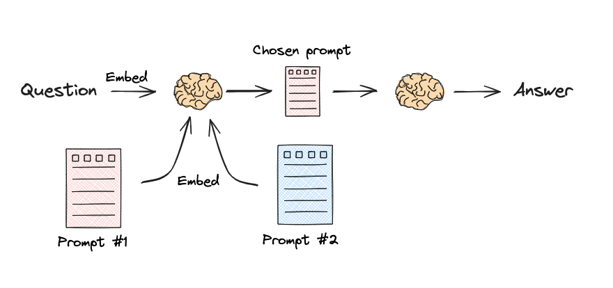

### Sematic Routing

This Python script uses the LangChain framework to dynamically route user queries to the most suitable prompt (Physics or Math) based on their semantic similarity. Here's a breakdown:

---

#### **1. Importing Necessary Libraries**
```python
from langchain.utils.math import cosine_similarity
from langchain_core.output_parsers import StrOutputParser
from langchain_core.prompts import PromptTemplate
from langchain_core.runnables import RunnableLambda, RunnablePassthrough
from langchain_ollama import OllamaEmbeddings, ChatOllama
```
The script imports utilities for embeddings, cosine similarity calculations, prompt management, and creating runnable chains. It uses the OllamaEmbeddings and ChatOllama models for embedding and language generation, respectively.
#### 2. Defining Prompts

Two templates are defined:

- Physics Prompt: For answering physics questions.
- Math Prompt: For solving math problems.
```python
physics_template = """You are a very smart physics professor. ...
{query}"""

math_template = """You are a very good mathematician. ...
{query}"""
```
### 3. Generating Prompt Embeddings

The prompts are converted into embeddings using the OllamaEmbeddings model.
```python
embeddings = OllamaEmbeddings(model='mxbai-embed-large')
prompt_templates = [physics_template, math_template]
prompt_embeddings = embeddings.embed_documents(prompt_templates)
```
Each prompt is represented as a vector in a high-dimensional space.
### 4. Routing Based on Query Similarity

The prompt_router function determines the best prompt based on cosine similarity between the query's embedding and the prompt embeddings:
```python
def prompt_router(input):
    query_embedding = embeddings.embed_query(input["query"])
    similarity = cosine_similarity([query_embedding], prompt_embeddings)[0]
    most_similar = prompt_templates[similarity.argmax()]
    print("Using MATH" if most_similar == math_template else "Using PHYSICS")
    return PromptTemplate.from_template(most_similar)
```
-The query is embedded.
- Cosine similarity is calculated between the query embedding and prompt embeddings.
- The prompt with the highest similarity score is selected.

### 5. Creating the Chain

The script defines a LangChain chain with these components:

1. RunnablePassthrough: Passes the query through unmodified.
2. RunnableLambda: Routes the query to the most appropriate prompt.
3. ChatOllama: Generates a response based on the chosen prompt.
4. StrOutputParser: Extracts the string output.
```python
chain = (
    {"query": RunnablePassthrough()}
    | RunnableLambda(prompt_router)
    | llm
    | StrOutputParser()
)
```
### 6. Invoking the Chain

The chain is executed with the query: "What's a black hole?".
```python
print(chain.invoke("What's a black hole"))
```
- The query is routed to the Physics prompt based on similarity.
- The model generates a response using the Physics prompt.

### Key Features

1. Dynamic Routing: Automatically selects the best prompt for a query.
2. Semantic Similarity: Uses cosine similarity for routing decisions.
3. Composable Chain: Flexible structure for handling query input, prompt selection, and response generation.

This script exemplifies how LangChain enables sophisticated routing and query processing pipelines for large language models.