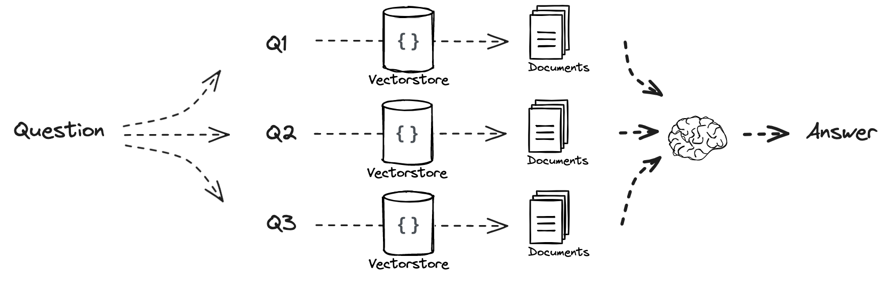

# Code Overview

## Multi Query

This code demonstrates a pipeline for retrieving and processing documents to answer user questions effectively using LangChain and related tools. The pipeline uses multi-query generation to enhance document retrieval from a vector database and a retrieval-augmented generation (RAG) approach for answering questions. The question is rephrased and the appropriate document chunks are joined by a distinct Union that is fed into the ollama llm.

## Code Description

### Multi-Query Generation
```python
from langchain.prompts import ChatPromptTemplate

# Multi Query: Different Perspectives
template = """You are an AI language model assistant. Your task is to generate five 
different versions of the given user question to retrieve relevant documents from a vector 
database. By generating multiple perspectives on the user question, your goal is to help
the user overcome some of the limitations of the distance-based similarity search. 
Provide these alternative questions separated by newlines. Original question: {question}"""
prompt_perspectives = ChatPromptTemplate.from_template(template)
```
- **Purpose**: Generate five variations of a user query to retrieve documents from a vector database more effectively by addressing limitations in similarity search.

### Query Processing and Parsing
```python
from langchain_core.output_parsers import StrOutputParser
from langchain_openai import ChatOpenAI

generate_queries = (
    prompt_perspectives 
    | ChatOpenAI(temperature=0) 
    | StrOutputParser() 
    | (lambda x: x.split("\n"))
)
```
- **Components**:
  - `ChatOpenAI`: A low-temperature language model to generate deterministic query variants.
  - `StrOutputParser`: Processes the generated text into structured output.
  - `lambda`: Splits the generated queries into a list.

### Unique Document Union
```python
from langchain.load import dumps, loads

def get_unique_union(documents: list[list]):
    """ Unique union of retrieved docs """
    # Flatten list of lists, and convert each Document to string
    flattened_docs = [dumps(doc) for sublist in documents for doc in sublist]
    # Get unique documents
    unique_docs = list(set(flattened_docs))
    # Return
    return [loads(doc) for doc in unique_docs]
```
- **Purpose**: Ensure the retrieved documents are unique by serializing them to strings, finding unique entries, and deserializing them back to document objects.

### Document Retrieval
```python
# Retrieve
question = "What is task decomposition for LLM agents?"
retrieval_chain = generate_queries | retriever.map() | get_unique_union
docs = retrieval_chain.invoke({"question":question})
len(docs)
```
- **Steps**:
  1. Generate alternative queries using `generate_queries`.
  2. Retrieve documents using `retriever.map()`.
  3. Get unique documents using `get_unique_union`.

### Retrieval-Augmented Generation (RAG)
```python
from operator import itemgetter
from langchain_openai import ChatOpenAI
from langchain_core.runnables import RunnablePassthrough

# RAG
template = """Answer the following question based on this context:

{context}

Question: {question}
"""
prompt = ChatPromptTemplate.from_template(template)

llm = ChatOpenAI(temperature=0)

final_rag_chain = (
    {"context": retrieval_chain, 
     "question": itemgetter("question")} 
    | prompt
    | llm
    | StrOutputParser()
)

final_rag_chain.invoke({"question":question})
```
- **Steps**:
  1. Context and question are combined into a prompt using `ChatPromptTemplate`.
  2. The prompt is processed using `ChatOpenAI`.
  3. Final output is parsed with `StrOutputParser()`.

### Final Output
The RAG pipeline generates a comprehensive answer to the user query by leveraging retrieved context and the language model.
